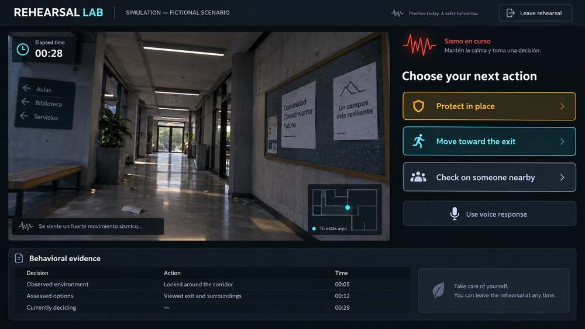
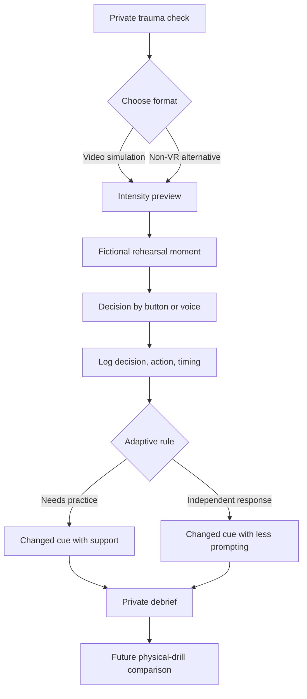
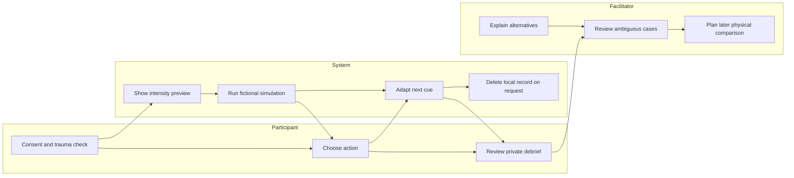

# Rehearsal Lab - Week 6 Build Packet

**Author:** Emiliano Carballido  
**Theme:** When experience can be manufactured  
**Declared vacuum:** Measurement  
**Status:** Packet completed before product code

## Problem in my words

Mexico already knows how to count attendance at drills. It does not yet know whether a rehearsal changes what a person decides when the routine breaks. Completion is not preparedness. The product must capture behavioral evidence - the decision, the action, and the time - without pretending that a browser simulation proves survival, competence, legal compliance, or building safety.

## Exact first user

An adult volunteer who belongs to a school civil-protection brigade on one fictional Mexico City campus. They have completed ordinary announced drills, but they have not practiced changed cues, blocked routes, or coordination choices in a private, measured simulation. This is a hypothesis-led pilot persona, not a claim based on completed field interviews.

## Success definition

Before the module closes, one consenting adult can complete three short, fictional rehearsal moments in a browser, make time-bound decisions by button or voice, receive an adaptive next moment based on the prior behavior, and view a private debrief that reports decisions, actions, timing, prompts, and practice priorities without issuing a preparedness score.

## Image-generated mockup

The image above was generated before product code. It establishes the interface hierarchy: simulated environment, time pressure, decision options, optional voice input, visible exit, and a behavioral-evidence record.

## Feature flow

## Actor swimlane

## Benchmark line

**Best existing reference:** Strivr's large-scale corporate VR training with Walmart shows that standardized immersive scenarios can be deployed and measured at scale; the Auckland City Hospital immersive serious-game study supplies a closer research precedent for defined learning objectives and assessment.

**How mine differs or localizes:** Rehearsal Lab uses original Mexican campus cues, treats decision-action-time as private behavioral evidence, offers an equal non-VR path, and requires a later physical-drill comparison before any improvement claim; it never converts completion into certification.

## Three-year light charter

If this slice works, the full product becomes a reviewed library of fictional rehearsal scenarios for Mexican school brigades, with institution-specific procedures and accessibility options. It compares simulation evidence with later physical-drill observations so customers can see whether learning transfers outside the screen. It remains a measurement and debrief system, not a fear product, compliance shortcut, insurance score, or prediction of survival.

## Scope cut

This version does not build a headset-native app, photorealistic digital twin, real-campus map, real-person avatar, family-photo upload, cloned voice, biometric or emotion analysis, administrator dashboard, public leaderboard, legal certificate, insurance integration, database, authentication, or claim of real-world effectiveness. It stores the current participant's invented demo record only on their device and includes a one-tap delete action.

## Blueprint conditions translated into product rules

1. Every place, person, and event is fictional; no real tragedy, fatal location, or victim is reconstructed.
2. A private trauma check, intensity preview, visible exit, and equal non-VR alternative appear before rehearsal.
3. No biometric, facial, or emotional capture. Only decision, action, timing, prompt use, and chosen mode are recorded locally.
4. Completion is never presented as competence, compliance, survival proof, or building-safety proof. The output is a private debrief and a proposed later physical comparison.
5. No participant payment or commercial claim appears in the pilot.
6. The interface states which claims remain unverified, especially transfer to real-earthquake behavior or survival.

## Architecture and Dragon Stack

| Layer | Implementation | Multiplicative role |
|---|---|---|
| Simulation / 3D / VR | Labeled browser video-sim using layered 3D-perspective scenes, motion, sound, and timed decision moments | Creates the bounded rehearsal context in which behavior can be observed |
| Adaptive / ML-style logic | Transparent weighted decision model using choice, delay, cue use, and previous hesitation | Selects the next changed cue and feedback; it is labeled as prototype adaptive logic, not trained ML |
| Voice signal | Browser speech recognition when available, with an equally valid button fallback | Converts a spoken intended action into the same decision event used by the adaptive model |

The stack is multiplicative: the simulated moment produces a behavior signal; button or voice captures the response; the adaptive model uses that evidence to change the next simulated moment and debrief.

## Privacy and security floor

- No API key, secret, external API, database, analytics tracker, or personal-data seed.
- All inputs use fixed choices or short bounded text; spoken transcripts are matched locally to a limited action vocabulary and are not uploaded.
- Demo records are invented and labeled. The local record can be deleted in one tap.
- No authentication is required because V1 stores no server-side personal data.
- Aggregate-only institutional reporting is a future constraint, not an implemented feature.

## Test plan

### Mechanical pass

1. Complete the trauma check and confirm both rehearsal modes are equally available.
2. Verify Start stays disabled until consent choices are complete.
3. Run a fast protective choice and confirm a harder changed cue follows.
4. Run a delayed or risky choice and confirm a supported adaptive cue follows.
5. Confirm every moment logs decision, action, elapsed time, input mode, and prompt use.
6. Test keyboard navigation, mobile layout, reduced-motion mode, mute, exit, restart, and delete-record controls.
7. Intentionally reproduce at least one bug, document it, fix it, and redeploy.

### Persona pass

Synthetic persona: **Marisol, 48**, school administrative employee and volunteer brigade member. She uses WhatsApp daily, reads slowly under pressure, dislikes games, experienced the 2017 earthquake, and may stop silently if an interface feels manipulative. Walk her through screenshots in order, log every hesitation, and fix the single most serious confusion before the deadline.

### Acceptance criteria

- Three coherent moments can be completed without reload.
- At least one next moment changes because of prior behavior.
- Voice and button input produce the same event structure.
- The debrief uses evidence language, never a readiness score.
- Exit and non-VR alternatives remain visible and legitimate.
- The six Blueprint conditions are visible in behavior or copy.

## Evidence boundaries and references

- Feng et al. (2020), *Advanced Engineering Informatics* 45, 101118, DOI: 10.1016/j.aei.2020.101118 - immersive serious-game research; reported endpoints do not prove lives saved.
- Strivr/Walmart deployment, cited in the Team 2 Blueprint - scale and test-score precedent, not earthquake-transfer or survival proof.
- Week 6 Brain Bending brief and Team 2 Blueprint supplied by Emiliano Carballido - user position, shadow clause, and six conditions.

